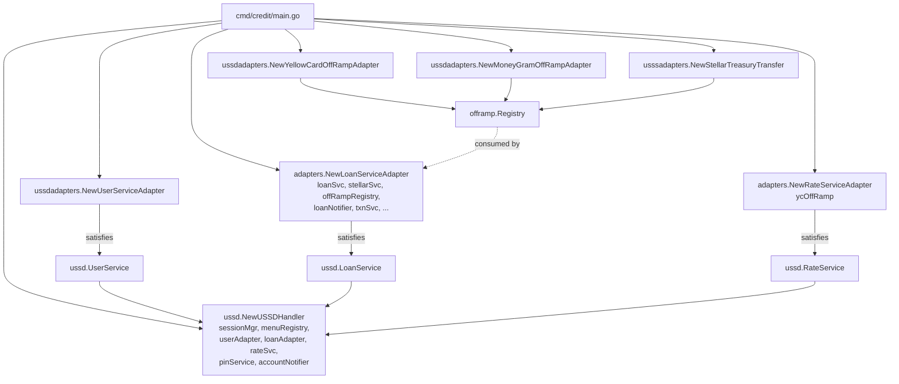

# Microvault Mobile

Developer reference for `pkg/mobile` — the mobile-channel surface. This is
where telecom gateways meet the platform: USSD for interactive menu flows
and SMS for outbound notifications and delivery reports.

The package is split by channel:

| Channel | Package | Purpose |
|---|---|---|
| USSD | [`pkg/mobile/ussd`](../../pkg/mobile/ussd) | Interactive menu-driven flow: register, request a loan, pick a payout method, repay, manage PIN. |
| SMS | [`pkg/mobile/sms`](../../pkg/mobile/sms) | Outbound SMS (provider registry + send) and inbound delivery-report callbacks. |

Both channels share the same shape: a **provider interface** declared in the
channel package, a **service** that holds a name → provider registry, and a
**transport adapter** per telecom gateway under `providers/<gateway>/`. The
HTTP controllers live in [`pkg/controllers`](../../pkg/controllers) and the
routes in [`internal/core/pkg/routes`](../../internal/core/pkg/routes).

For the package-level `go doc` surface and the USSD architecture diagram, see
[`pkg/mobile/ussd/README.md`](../../pkg/mobile/ussd/README.md) and
[`pkg/mobile/ussd/doc.go`](../../pkg/mobile/ussd/doc.go). This doc is the
**how-to** view: how a request flows end to end, how to add a provider, and
how the credit module plugs in.

---

## Architecture

```mermaid
flowchart TD
    GW[telecom gateway<br/>Africa's Talking] -->|HTTP form post| USSDR[/mobile/ussd/:provider]
    GW -->|HTTP form post| SMSR[/mobile/sms/:provider/delivery]

    USSDR --> USSDCtrl[controllers.USSDController]
    SMSR --> SMSCtrl[controllers.SMSCallbackController]

    USSDCtrl --> USSDSvc[ussd.USSDService]
    SMSCtrl --> SMSH[sms.DeliveryReportHandler]

    USSDSvc --> USSDProv[ussd.USSDProvider]
    USSDProv --> USSDH[ussd.USSDHandler]

    USSDH --> Ports[port interfaces:<br/>UserService, LoanService,<br/>RateService, PINService]
    Ports --> Adapters[adapters in pkg/mobile/ussd/adapters<br/>UserServiceAdapter + credit module<br/>LoanServiceAdapter, RateServiceAdapter]

    SMSH -.->|outbound SMS goes the other way| SMSSvc[sms.SMSService]
    SMSSvc --> SMSProv[SMSProvider interface]
```

Two things to read off the diagram:

- **USSD and SMS are independent channels.** They share the
  provider-registry pattern but not a code path. A request hits one channel's
  controller and never crosses into the other.
- **USSD has ports; SMS does not.** The USSD handler depends on four narrow
  interfaces (`UserService`, `LoanService`, `RateService`, `PINService`) so
  the menu logic stays decoupled from the lending and identity services. SMS
  is a thinner send-and-ingest surface with no domain ports —
  `SMSService` just holds providers and `DeliveryReportHandler` just
  dispatches callbacks.

---

## USSD

### Request lifecycle

1. **Transport in.** The telecom gateway POSTs form-encoded data to
   `/api/v1/mobile/ussd/:provider`. The route is registered in
   [`internal/core/pkg/routes/public_routes.go`](../../internal/core/pkg/routes/public_routes.go);
   the `:provider` URL param selects the transport. `USSDController.HandleCallback`
   reads the form into a `map[string]string` and hands it to
   `ussd.USSDService.HandleRequest`.

2. **Provider resolve + parse.** `USSDService` looks up the named
   `USSDProvider` and calls `ValidateRequest` then `ParseRequest`. The
   provider turns its gateway-specific form fields into a normalized
   `USSDRequest` (session ID, phone, service code, network code, current
   input). For Africa's Talking, the `text` field accumulates every input as
   `input1*input2*input3`; the provider extracts only the last segment as the
   current input.

3. **Session resolve.** `USSDHandler.HandleRequest` calls
   `SessionManager.GetOrCreateSession` against Redis (5-minute TTL). A new
   session starts at the language menu; an existing session resumes at
   `session.CurrentMenu`.

4. **First dial vs. continuation.** Empty input means a fresh dial.
   `handleInitialRequest` calls `UserService.GetUserWithAccounts` and routes
   to registration (unknown number) or the main menu (registered user). On a
   retry with the same session ID the menu is always reset to `main` to
   avoid stale state.

5. **Menu dispatch.** `handleMenuInput` looks up `session.CurrentMenu` in the
   `MenuRegistry` and invokes that menu's `MenuHandler` with a `MenuContext`
   (session + input + manager). The handler returns a `MenuResponse` —
   `MenuTypeContinue` ("CON") keeps the session open, `MenuTypeEnd` ("END")
   releases it.

6. **Side effects.** Handlers call the port interfaces (`LoanService`,
   `PINService`, etc.) for any real work. PII-bearing menus (registration,
   PIN entry, national ID) are listed in `sensitiveMenus` and logged with
   redaction; phone numbers are always redacted in logs.

7. **Transport out.** The handler's string response is wrapped in a
   `USSDResponse` and handed back to the provider's `FormatResponse`, which
   returns the gateway-specific shape (for Africa's Talking, `"CON ..."` or
   `"END ..."`).

### The port interfaces

The handler never imports a concrete service. It programs against four
interfaces declared in [`pkg/mobile/ussd/types.go`](../../pkg/mobile/ussd/types.go):

| Port | Methods | Satisfied by |
|---|---|---|
| `ussd.UserService` | `GetUserWithAccounts`, `RegisterUser` | `adapters.UserServiceAdapter` (in `pkg/mobile/ussd/adapters`) |
| `ussd.LoanService` | `GetUserLoans`, `RequestLoan`, `CheckLoanEligibility`, `GetProductConfig`, `GetRepaymentQuote` | `LoanServiceAdapter` (in the credit module) |
| `ussd.RateService` | `GetExchangeRate` | `RateServiceAdapter` (in the credit module) |
| `ussd.PINService` | `SetPIN`, `VerifyPIN`, `ChangePIN`, `ResetPIN`, `IsLocked`, `HasPIN`, security-question methods | `pin.Service` (in `pkg/pin`) |

Plus a `contracts.AccountNotifier` for side-effect SMS (registration
confirmations, PIN warnings, lockout notices). Passing `nil` for the notifier
substitutes a no-op.

### Adding a USSD transport

A new telecom gateway (e.g. a second aggregator alongside Africa's Talking)
is one package and one registration call.

**1.** Create `pkg/mobile/ussd/providers/<gateway>/adapter.go` and implement
[`ussd.USSDProvider`](../../pkg/mobile/ussd/types.go):

```go
package mygateway

import (
    "context"
    "github.com/Shamba-Records-Limited/microvault/pkg/mobile/ussd"
)

type GatewayUSSDAdapter struct { /* config, http client, … */ }

func NewGatewayUSSDAdapter(/* cfg */) *GatewayUSSDAdapter { /* … */ }

// Compile-time check.
var _ ussd.USSDProvider = (*GatewayUSSDAdapter)(nil)

func (a *GatewayUSSDAdapter) ValidateRequest(ctx context.Context, data map[string]string) error {
    // reject missing required fields, bad phone format, etc.
}

func (a *GatewayUSSDAdapter) ParseRequest(ctx context.Context, data map[string]string) (*ussd.USSDRequest, error) {
    // turn the gateway's form fields into a normalized USSDRequest.
    // USSDRequest.Input must be the *current* input only — strip any
    // accumulated history the gateway echoes back.
}

func (a *GatewayUSSDAdapter) FormatResponse(ctx context.Context, response *ussd.USSDResponse) (any, error) {
    // turn the normalized CON/END response into the gateway's expected shape.
}

func (a *GatewayUSSDAdapter) GetProviderName() string { return "mygateway" }
```

**2.** Register it at boot in `cmd/credit/main.go` (or `cmd/microvault/main.go`
if you're running the core binary standalone):

```go
ussdService.RegisterProvider("mygateway", mygateway.NewGatewayUSSDAdapter(/* cfg */))
```

**3.** Point the gateway at `POST /api/v1/mobile/ussd/mygateway`. The route
already exists — the `:provider` param is what selects the transport. No
route file changes.

The key thing to get right is `ParseRequest`: USSD gateways differ in how
they echo accumulated input, and the handler expects `USSDRequest.Input` to
be only the current keystroke. Africa's Talking accumulates as
`input1*input2*input3`; your gateway may send only the latest input, or a
different delimiter, or a session continuation flag. Normalize to the last
input in `ParseRequest`.

---

## SMS

SMS is two half-channels bolted into one package: **outbound send** (the
service calls a provider) and **inbound delivery reports** (the provider
calls a webhook).

### Outbound: sending SMS

```go
smsSvc := sms.NewSMSService()
smsSvc.RegisterProvider("africastalking", atAdapter)

resp, err := smsSvc.GetProvider("africastalking").SendSMS(ctx, sms.SMSRequest{
    To:      "2547XXXXXXXX",
    Message: "Your loan of KES 500 has been disbursed.",
    From:    "SHAMBA", // sender ID; resolved from config
})
```

`SMSService` is a name → `SMSProvider` registry. `SMSRequest` carries the
recipient list (`To` for one, `ToMultiple` for bulk), message body, sender
ID, and a typed `ProviderOptions` map for provider-specific extras. The
response is `SMSResponse` with a typed `ProviderData` field.

The platform doesn't call `SMSService` directly from handlers. It goes
through `pkg/notifications`, which wraps an `SMSProvider` in a
`Notifier` (`SMSNotifier`, `SMSLoanNotifier`, `SMSAccountNotifier`) so that
domain code depends on `contracts.Notifier` / `contracts.AccountNotifier`
and stays ignorant of SMS as a transport.

### Inbound: delivery reports

When a provider delivers (or fails to deliver) a message, it POSTs to
`/api/v1/mobile/sms/:provider/delivery`. The route lands in
`SMSCallbackController.HandleDeliveryReport`, which parses the form into an
`sms.DeliveryReport` (message ID, status, phone, network, failure reason)
and hands it to `sms.DeliveryReportHandler.HandleReport`.

By default the handler logs each report as a structured `slog` entry with the
phone number redacted. Override the sink with `sms.WithReportHandler`:

```go
h := sms.NewDeliveryReportHandler(
    sms.WithReportHandler(func(ctx context.Context, r sms.DeliveryReport) {
        if r.IsFinalStatus() {
            // persist to your delivery-tracking table
        }
    }),
)
```

`DeliveryReport.IsFinalStatus()` returns true for terminal states
(`Sent`, `Submitted`, `Buffered`, `Rejected`, `Success`, `Failed`,
`AbsentSubscriber`, `Expired`) — i.e. no further updates expected.

### Adding an SMS transport

**1.** Create `pkg/mobile/sms/providers/<gateway>/adapter.go` and implement
[`sms.SMSProvider`](../../pkg/mobile/sms/service.go):

```go
package mygateway

import (
    "context"
    "github.com/Shamba-Records-Limited/microvault/pkg/mobile/sms"
)

type GatewaySMSAdapter struct { /* http client, credentials, … */ }

func NewGatewaySMSAdapter(/* cfg */) *GatewaySMSAdapter { /* … */ }

var _ sms.SMSProvider = (*GatewaySMSAdapter)(nil)

func (a *GatewaySMSAdapter) SendSMS(ctx context.Context, req sms.SMSRequest) (sms.SMSResponse, error) {
    // POST to the gateway, parse the response, return sms.SMSResponse{ProviderData: ...}
}

func (a *GatewaySMSAdapter) SendSingleSMS(ctx context.Context, to, message, from string) (sms.SMSResponse, error) {
    return a.SendSMS(ctx, sms.SMSRequest{To: to, Message: message, From: from})
}

func (a *GatewaySMSAdapter) SendBulkSMS(ctx context.Context, to []string, message, from string) (sms.SMSResponse, error) {
    return a.SendSMS(ctx, sms.SMSRequest{ToMultiple: to, Message: message, From: from})
}
```

**2.** Register it at boot:

```go
smsSvc.RegisterProvider("mygateway", mygateway.NewGatewaySMSAdapter(/* cfg */))
```

**3.** For delivery reports, point the gateway at
`POST /api/v1/mobile/sms/mygateway/delivery`. The route already exists; the
`:provider` param is informational (the controller doesn't switch on it —
the `DeliveryReport` shape is provider-agnostic). If your gateway POSTs a
different field set, extend `DeliveryReport` and the parsing in
`SMSCallbackController.HandleDeliveryReport`.

---

## How the credit module wires in

The USSD handler's `LoanService` and `RateService` ports are **not**
satisfied inside `pkg/mobile/`. They're satisfied by the credit module — a
separate binary (`cmd/credit`) that depends on `pkg/mobile/ussd` and supplies
the adapters. This keeps the lending logic out of the core platform module
while letting the USSD flow drive loan requests.

The wiring happens in `cmd/credit/main.go` and is the reason that binary
exists separately from `cmd/microvault`:



Three things to notice:

1. **The off-ramp adapters live in `pkg/mobile/ussd/adapters/`** (in the
   core module) because they're USSD-channel glue — they translate between
   the USSD loan request shape and the `offramp.Provider` contract. But they
   implement `offramp.Provider` (the payment contract), **not** `ussd.LoanService`.
   They're registered in the `offramp.Registry` and consumed by the credit
   module's `LoanServiceAdapter` through that registry. See
   [`pkg/payment/README.md`](../../pkg/payment/README.md) for the contract.

2. **`LoanServiceAdapter` is the orchestrator.** It's the credit module's
   `ussd.LoanService` implementation. `RequestLoan` runs the full disbursement
   cycle: eligibility → create → approve → vault borrow → off-ramp → notify.
   It depends on `offramp.Provider` (just `Initiate`), not on any specific
   provider's concrete type.

3. **`RateServiceAdapter` wraps an `offramp.Quoter`.** The USSD pre-loan rate
   display needs a live FX quote; the credit module points the rate adapter
   at the YellowCard off-ramp adapter (which implements `offramp.Quoter`).
   MoneyGram's FX cascade is consumed inside `LoanServiceAdapter`, not here.

The core binary (`cmd/microvault`) passes `nil` for `loanService` and
`rateService` — the USSD flow runs but loan/repay screens are unreachable.
The credit binary (`cmd/credit`) supplies the real adapters. This is why the
two binaries exist: the core module owns the platform (identity, accounts,
Stellar, mobile transports); the credit module owns lending and wires the
loan surface into the USSD handler.

---

## Conventions

- **Phone numbers are redacted in logs.** `redactPhone` (in both `ussd` and
  `sms`) masks the middle digits; USSD goes further and lists
  PII-bearing menus in `sensitiveMenus` so their input is never logged
  verbatim.
- **Provider selection is by name, not by type.** Both `USSDService` and
  `SMSService` hold a `map[string]Provider`; the HTTP route's `:provider`
  param is the lookup key. Adding a provider never touches a route file.
- **Sessions are Redis-backed with a 5-minute TTL.** The TTL is configurable
  via `NewSessionManager`'s `sessionDuration` arg; pass `0` for the default.
- **The menu graph is registered once at boot.** `StandardLoanMenuPreset`
  wires the full registration / loan / repay / PIN / security-question flow.
  Adding a screen means extending the preset and writing a handler method on
  `USSDHandler`; see [`pkg/mobile/ussd/README.md`](../../pkg/mobile/ussd/README.md)
  for the file map.

## Related docs

- [`pkg/mobile/ussd/README.md`](../../pkg/mobile/ussd/README.md) — the USSD
  architecture diagram, request lifecycle, and file/subpackage map.
- [`pkg/mobile/ussd/doc.go`](../../pkg/mobile/ussd/doc.go) — the `go doc`
  surface for the USSD package.
- [`pkg/mobile/sms/doc.go`](../../pkg/mobile/sms/doc.go) — the `go doc`
  surface for the SMS package.
- [`pkg/payment/README.md`](../../pkg/payment/README.md) — the off-ramp
  contract the USSD adapters implement.
- [`pkg/pin/doc.go`](../../pkg/pin/doc.go) — the PIN service that satisfies
  `ussd.PINService`.
- [`docs/offramp/README.md`](../offramp/README.md) — the off-ramp area doc
  (settlement modes, webhook state machine, provider overrides).
