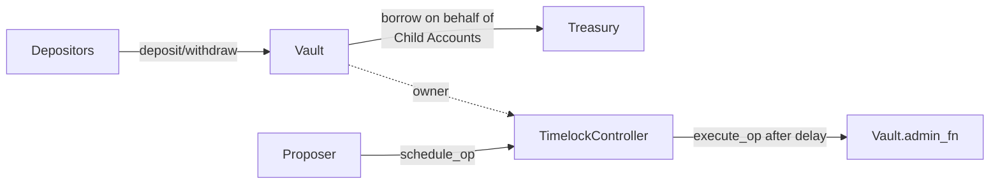

# Microvault Soroban Contracts

Developer reference for the on-chain contracts that power Microvault: a [SEP-0056](https://github.com/stellar/stellar-protocol/blob/master/ecosystem/sep-0056.md) tokenized vault with credit delegation, fronted by a time-delayed governance controller.

The system is deployed as **two contracts**:

- **Vault** (`microvault-sep56`): SEP-56 vault that accepts USDC deposits, mints share tokens, and lets a treasury borrow against deposits on behalf of child accounts.
- **TimelockController** (`microvault-timelock-controller`): OpenZeppelin timelock implementation that owns the Vault and enforces a delay between proposing and executing every privileged admin operation.

## Architecture

Day-to-day depositor and treasury calls hit the Vault directly. Anything privileged — changing limits, replacing the treasury, upgrading WASM, unpausing — is routed through the TimelockController, so every change is publicly visible during the delay window before it takes effect.

## Dependencies

Both contracts are built on the [OpenZeppelin Stellar Contracts](https://docs.openzeppelin.com/stellar-contracts) library, pinned to `=0.7.2` against `soroban-sdk` `26.1.0` (see [`soroban/Cargo.toml`](../../soroban/Cargo.toml)):

| Crate | Provides | Used by |
|---|---|---|
| [`stellar-access`](https://crates.io/crates/stellar-access/0.7.2) | `Ownable`, `AccessControl` (role-based auth), `ensure_role`, `set_admin` | Vault, TimelockController |
| [`stellar-governance`](https://crates.io/crates/stellar-governance/0.7.2) | `timelock` module — `Operation`, `OperationState`, `schedule`/`execute`/`cancel`, `TimelockError` ([OZ docs](https://docs.openzeppelin.com/stellar-contracts/governance/timelock-controller)) | TimelockController |
| [`stellar-tokens`](https://crates.io/crates/stellar-tokens/0.7.2) | `fungible::FungibleToken`, `vault::{FungibleVault, Vault}` (SEP-56 base) | Vault |
| [`stellar-contract-utils`](https://crates.io/crates/stellar-contract-utils/0.7.2) | `math::wad::{Wad, WAD_SCALE}` (18-decimal fixed-point), `pausable::Pausable` | Vault |
| [`stellar-macros`](https://crates.io/crates/stellar-macros/0.7.2) | `#[only_owner]`, `#[only_admin]`, `#[only_role]`, `#[when_not_paused]` auth-gate macros | Vault, TimelockController |

For the authoritative reference on each crate, see its crates.io page (linked above), the [OpenZeppelin Stellar Contracts docs](https://docs.openzeppelin.com/stellar-contracts), or the crate's own `rustdoc`. When extending either contract, prefer composing these primitives over rolling your own — the macros in particular wire auth checks into the host's `require_auth` flow in ways that are easy to get wrong by hand. See each contract's source for the import shape.

## Deployed Contracts (Testnet)

| Contract | Address |
|---|---|
| Vault | [`CDZVKARLUCAYYIV2TPSR6PLWLETPS4TYE2QXVXSQT27QNFYE3GEE5IS5`](https://stellar.expert/explorer/testnet/contract/CDZVKARLUCAYYIV2TPSR6PLWLETPS4TYE2QXVXSQT27QNFYE3GEE5IS5) |
| TimelockController | [`CAL3RYRW6MJ2BMKP2J7G47BPBFWKZ7K2BMRG2EXZWQI5ZZAHFPM7NO7B`](https://stellar.expert/explorer/testnet/contract/CAL3RYRW6MJ2BMKP2J7G47BPBFWKZ7K2BMRG2EXZWQI5ZZAHFPM7NO7B) |

## Documentation Map

| Doc | Read this when you want to… |
|---|---|
| [Vault](./vault.md) | Integrate as a depositor, treasury operator, or wallet. Full surface of the Vault contract: deposit/withdraw, borrow/repay, views, events, errors, constants. |
| [TimelockController](./timelock-controller.md) | Propose, execute, or cancel governance operations. Operation lifecycle, role model, scheduling and execution semantics. |
| [Operations](./operations.md) | Build, deploy, upgrade, or run admin workflows. Copy-pasteable `stellar` CLI commands for the schedule ----> wait ----> execute pattern. |

## Conventions Used Across These Docs

- All CLI examples use the [Stellar CLI](https://developers.stellar.org/docs/tools/developer-tools/cli/stellar-cli) and assume the env vars defined in [Operations § Prerequisites](./operations.md#prerequisites) (`$VAULT_ID`, `$TIMELOCK_ID`, `$NETWORK`, `$DEPLOYER`, `$TREASURY`, `$GUARDIAN`, `$USDC_ID`, `$RPC_URL`, `$DEPOSITOR`, `$CHILD_ACCOUNT`).
- Amounts are quoted in **stroops of the underlying asset** (USDC has 7 decimals: `10_000_000` stroops = 1 USDC). Share token amounts use 13 decimals (USDC's 7 plus the vault's 6-decimal offset).
- The Vault's lock period is measured in **seconds** (ledger timestamp). The TimelockController's `min_delay` and per-op `delay` are measured in **ledger sequence counts** (~5 s/ledger). The two units are different. See the critical-notes section in each doc.
