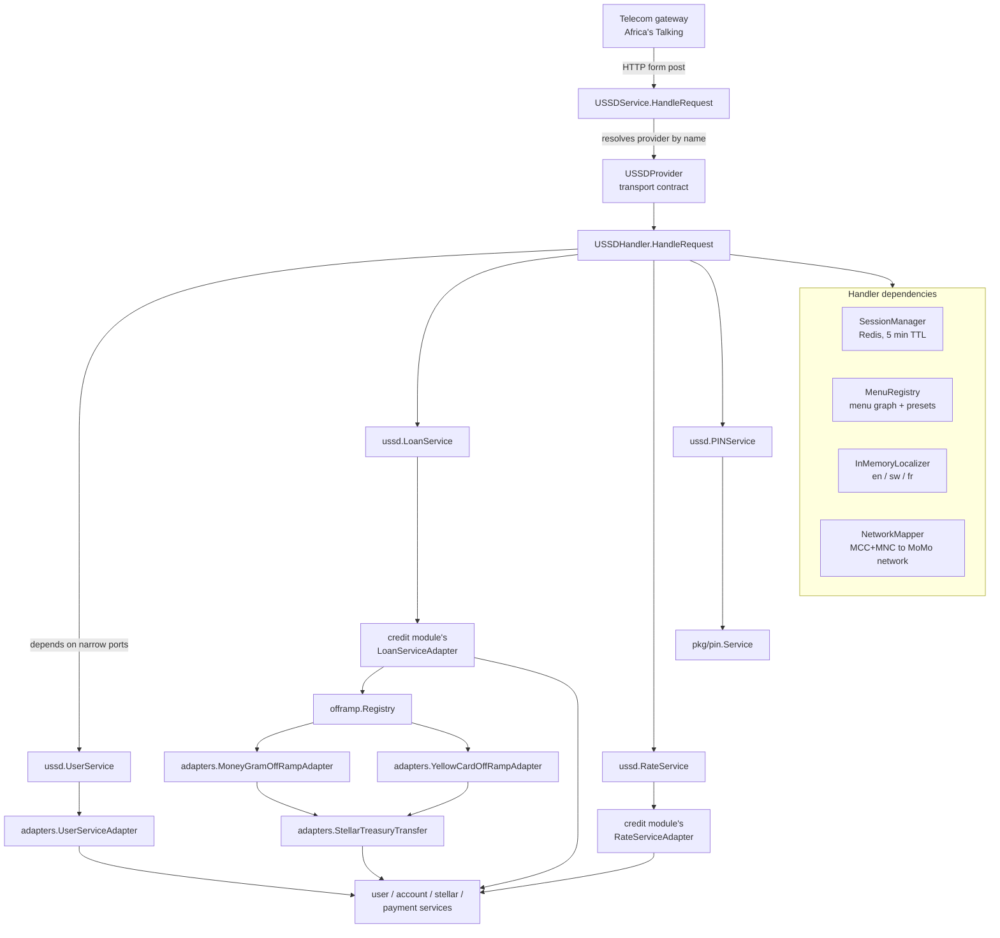

# pkg/mobile/ussd

The interactive USSD application — the menu-driven flow a mobile subscriber
walks through to register, request a loan, pick a payout method, repay, and
manage their PIN. The concepts
(the session model, the menu engine, the port interfaces) live in
[`doc.go`](./doc.go) and are visible via `go doc ./pkg/mobile/ussd`.

## Layer diagram



Two things to read off the diagram:

- **The handler never imports a concrete service.** It programs against four
  port interfaces (`UserService`, `LoanService`, `RateService`, `PINService`)
  plus a `contracts.AccountNotifier`. Every arrow out of the handler crosses
  an interface boundary.
- **The off-ramp adapters are not USSD ports.** `MoneyGramOffRampAdapter` and
  `YellowCardOffRampAdapter` implement `offramp.Provider` (the payment
  contract), not `ussd.LoanService`. They sit inside `pkg/mobile/ussd/adapters/`
  because they're USSD-channel glue, but they're consumed by the credit
  module's `LoanServiceAdapter` through the `offramp.Registry`, not by the
  USSD handler directly.

## Request lifecycle

1. **Transport in.** The telecom gateway POSTs to the HTTP endpoint. The
   route resolves a `USSDProvider` by name from `USSDService` and calls
   `ParseRequest`, which normalizes the gateway's form fields into a
   `USSDRequest` (session ID, phone, service code, network code, current
   input). For Africa's Talking the `text` field accumulates all inputs as
   `input1*input2*input3`; the provider extracts only the last segment.
2. **Session resolve.** `USSDHandler.HandleRequest` calls
   `SessionManager.GetOrCreateSession` against Redis. A new session starts at
   the language menu; an existing session resumes at `session.CurrentMenu`.
   Sessions expire after 5 minutes of inactivity.
3. **First dial vs. continuation.** Empty input means a fresh dial —
   `handleInitialRequest` checks `UserService.GetUserWithAccounts` and routes
   to registration (unknown number) or the main menu (registered user). On a
   retry with the same session ID the menu is always reset to `main` to avoid
   stale state.
4. **Menu dispatch.** `handleMenuInput` looks up `session.CurrentMenu` in the
   `MenuRegistry` and invokes that menu's `MenuHandler` with a `MenuContext`
   (session + input + manager). The handler returns a `MenuResponse` —
   `MenuTypeContinue` ("CON") keeps the session open, `MenuTypeEnd` ("END")
   releases it.
5. **Side effects.** Handlers call the port interfaces (`LoanService`,
   `PINService`, etc.) for any real work. PII-bearing menus (registration,
   PIN entry, national ID) are listed in `sensitiveMenus` and logged with
   redaction; phone numbers are always redacted in logs.
6. **Transport out.** The handler's string response is wrapped in a
   `USSDResponse` and handed back to the provider's `FormatResponse`, which
   returns the gateway-specific shape.

## Package layout

```
pkg/mobile/ussd/
├── doc.go                  # concepts — the go doc surface
├── README.md               # this file — architecture & navigation
├── handler.go              # USSDHandler: request routing, menu dispatch, all screen handlers
├── service.go              # USSDService: provider registry + request dispatch
├── session.go              # SessionManager: Redis-backed session lifecycle
├── types.go                # Session, Menu, MenuRegistry, port interfaces, request/response DTOs
├── menu.go                 # MenuBuilder + MenuRegistry
├── menu_presets.go         # StandardLoanMenuPreset: the full menu graph (register, loan, repay, PIN)
├── localization.go         # InMemoryLocalizer: language-keyed translations with fallback
├── network_mapper.go       # NetworkMapper: MCC+MNC → MoMo network + ISO country
├── adapters/               # USSD-to-domain glue (see adapters/doc.go)
│   ├── doc.go
│   ├── user_service_adapter.go      # ussd.UserService ← user + account + stellar
│   ├── offramp_moneygram.go         # offramp.Provider ← moneygram.Client
│   ├── offramp_yellowcard.go        # offramp.Provider ← yellowcard.YellowcardAdapter
│   └── treasury_transfer.go         # offramp.TreasuryTransfer ← stellar.Service
└── providers/              # transport adapters (USSDProvider implementations)
    └── africastalking/
        └── adapter.go      # Africa's Talking USSD gateway
```

## What lives where, and why

| If you're changing… | …edit this file |
|---|---|
| A screen's text, options, or flow | `menu_presets.go` (the menu graph) or `handler.go` (the screen handler) |
| The shape of `Session` / `Menu` / a port interface | `types.go` |
| How sessions are stored or expire | `session.go` |
| A translation string or a new language | `localization.go` (+ the menu's `WithTitle`/`WithOption` maps) |
| A telco → MoMo network mapping | `network_mapper.go` |
| How a USSD gateway's HTTP is parsed/formatted | `providers/<gateway>/adapter.go` |
| How the USSD flow calls user/account/stellar | `adapters/user_service_adapter.go` |
| How an off-ramp provider is invoked from USSD | `adapters/offramp_<provider>.go` (but the contract is `pkg/payment/offramp`) |
| Treasury USDC movement for settlement | `adapters/treasury_transfer.go` |

## Related docs

- [`doc.go`](./doc.go) — the concept surface (`go doc ./pkg/mobile/ussd`).
- [`adapters/doc.go`](./adapters/doc.go) — the ports-and-glue overview.
- [`pkg/payment/README.md`](../../payment/README.md) — the off-ramp contract
  the adapters implement, and the registry-based routing.
- [`pkg/pin/doc.go`](../../pin/doc.go) — the PIN service that satisfies
  `ussd.PINService`.
